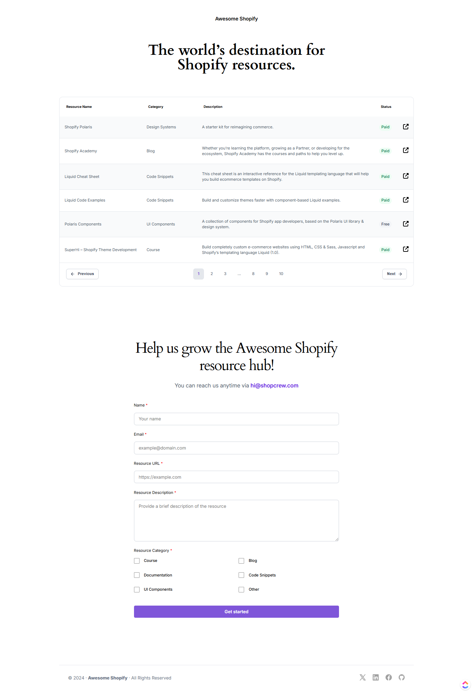

# Awesome Shopify Resource Hub

A beautifully designed static website that serves as a comprehensive resource hub for Shopify developers and enthusiasts. This project is created using HTML and CSS to provide users with a curated list of Shopify-related resources and an intuitive form to submit additional resources.

## Project Overview

The "Awesome Shopify Resource Hub" website allows users to:
1. View a categorized list of Shopify resources.
2. Submit new resources for inclusion in the resource hub via a simple form.
3. Contact the support team for assistance.

## Features

- **Resource Table**: A paginated table displaying Shopify resources, categorized for easy navigation.
- **Resource Submission Form**: An interactive form to allow users to submit new resources, including fields for name, email, URL, description, and category.
- **Responsive Footer**: A clean, responsive footer with social media and contact icons.

## Technologies Used

- **HTML**: For structuring the content.
- **CSS**: For styling the elements, including layout, fonts, colors, and responsiveness.

## Screenshots

## Contact

For inquiries, suggestions, or support, please contact us at [hi@shopcrew.com](mailto:hi@shopcrew.com). We look forward to hearing from you.

## License

This project is licensed under the MIT License. See the `LICENSE` file for more information.

---
Thank you for exploring the Awesome Shopify Resource Hub! We hope this platform becomes a go-to destination for anyone working with Shopify, empowering developers and creators worldwide.
---